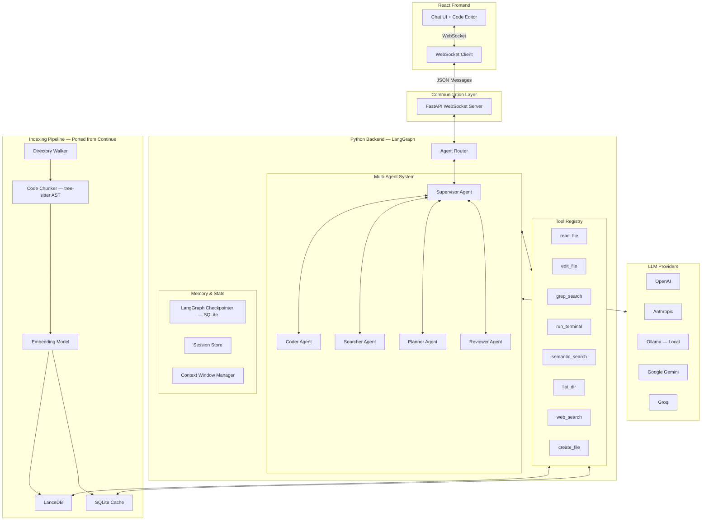
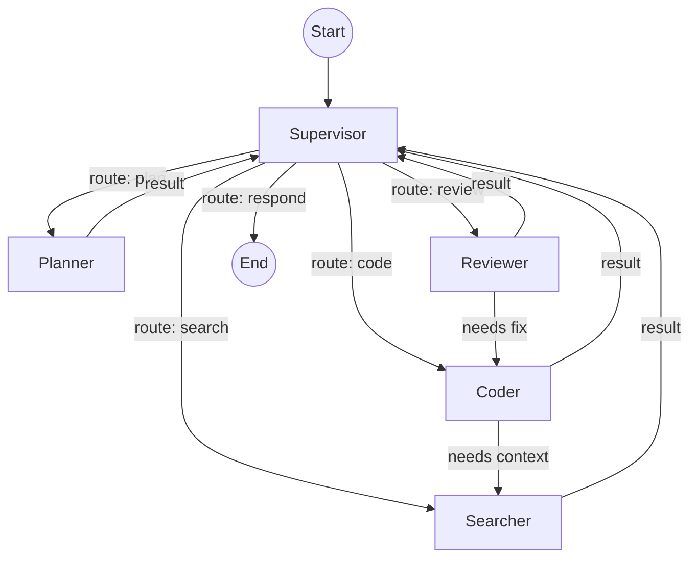
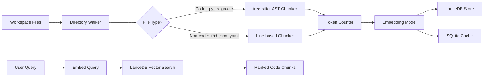
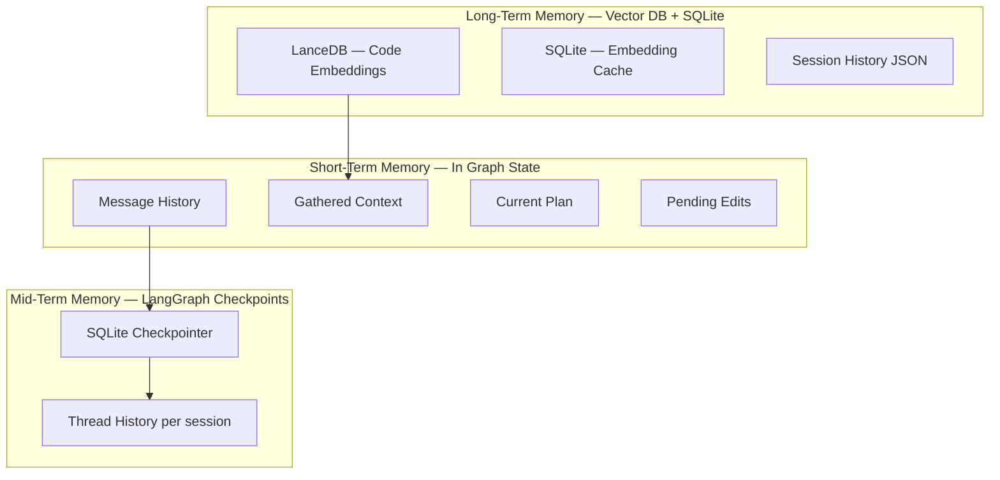

# 📚 Prerequisites — Concepts to Learn Before Building

> Master these concepts layer by layer. Each builds on the previous one.

---

## Layer 1: Python Foundations

| # | Concept | Why You Need It | Play With |
|---|---------|-----------------|-----------|
| 1 | **Python `asyncio`** | FastAPI, WebSockets, and LangGraph are all async | `asyncio.gather()`, `async for`, `asyncio.Queue` |
| 2 | **AsyncGenerators** (`async def* / yield`) | Streaming LLM responses token-by-token | Write a generator that yields words one at a time |
| 3 | **Pydantic Models** | All data schemas (AgentState, Chunk, configs) | Define nested models with validation |
| 4 | **`TypedDict` & `Annotated` types** | LangGraph state definitions require these | Create a TypedDict with Annotated fields |
| 5 | **Context Managers** (`async with`) | Database connections, file handling | Build a custom async context manager |

---

## Layer 2: LLM Basics

| # | Concept | Why You Need It | Play With |
|---|---------|-----------------|-----------|
| 6 | **Chat Completions API** | Core of how LLMs work (messages → response) | Call OpenAI/Ollama API directly with `curl` |
| 7 | **Streaming Responses** | Token-by-token output for real-time UX | Stream a response and print tokens as they arrive |
| 8 | **System/User/Assistant Roles** | Message structure for multi-turn conversations | Build a simple chatbot with message history |
| 9 | **Tool/Function Calling** | LLM tells us WHICH tool to call with WHAT args | Make an LLM call a weather function |
| 10 | **Structured Output** | Force LLM to return JSON matching a schema | Use `response_format` or `.with_structured_output()` |
| 11 | **Context Window & Tokens** | Understanding model limits and token counting | Use `tiktoken` to count tokens in a large file |

---

## Layer 3: LangChain Core

| # | Concept | Why You Need It | Play With |
|---|---------|-----------------|-----------|
| 12 | **`ChatModel` interface** | Unified API across OpenAI, Anthropic, Ollama | `ChatOpenAI()`, `ChatAnthropic()`, `ChatOllama()` |
| 13 | **`BaseMessage` types** | `HumanMessage`, `AIMessage`, `ToolMessage`, `SystemMessage` | Build a conversation with all 4 message types |
| 14 | **`@tool` decorator** | Define tools the LLM can call | Create 3 tools and bind them to a model |
| 15 | **`.bind_tools()` and `.invoke()`** | Connecting tools to models | Make an LLM decide which tool to use |
| 16 | **`ToolNode`** | Auto-executes tool calls from LLM responses | Use ToolNode in a simple chain |
| 17 | **Prompt Templates** | `ChatPromptTemplate` for system prompts | Create a template with variables |

---

## Layer 4: LangGraph — The Agentic Framework

| # | Concept | Why You Need It | Play With |
|---|---------|-----------------|-----------|
| 18 | **`StateGraph`** | Core abstraction — defines the agent graph | Build a 2-node graph that passes state |
| 19 | **State with `Annotated` + `add_messages`** | How LangGraph accumulates messages automatically | Create AgentState and watch messages grow |
| 20 | **Nodes** (functions as graph nodes) | Each agent is a node that reads/writes state | Create a node that appends to state |
| 21 | **Edges & `add_edge()`** | Fixed routing between nodes | Connect A → B → C linearly |
| 22 | **Conditional Edges** | Dynamic routing (Supervisor → which agent?) | Route based on a LLM's structured output |
| 23 | **`START` and `END`** | Entry/exit points of the graph | Build a graph with conditional END |
| 24 | **ReAct Agent pattern** | Single agent + tools in a loop | Build a ReAct agent with 3 tools |
| 25 | **Multi-Agent with Supervisor** | Supervisor routes to specialist agents | Build Supervisor → Coder + Searcher |
| 26 | **`astream_events()`** | Stream graph execution events to frontend | Stream and print each event type |
| 27 | **Checkpointers (`SqliteSaver`)** | Persist state across sessions, enable resume | Save a conversation, restart, and resume it |
| 28 | **Thread IDs** | Separate conversation threads | Run 2 conversations in parallel with different thread_ids |
| 29 | **Human-in-the-Loop** | Pause graph for user approval (tool policies) | Build a graph that waits for human approval |
| 30 | **Subgraphs** | Nested graphs (Coder has its own internal graph) | Embed a subgraph inside a parent graph |

---

## Layer 5: Vector Databases & Embeddings

| # | Concept | Why You Need It | Play With |
|---|---------|-----------------|-----------|
| 31 | **What are Embeddings?** | Convert text → numbers for similarity search | Embed 5 sentences and print their vectors |
| 32 | **Cosine Similarity** | How "closeness" between vectors is measured | Compute similarity between query and 10 chunks |
| 33 | **Chunking Strategies** | Why you can't embed entire files | Split a file by lines (basic) and by functions (AST) |
| 34 | **LanceDB** | The embedded vector DB (no server needed) | Create a table, insert vectors, search |
| 35 | **SQLite** | Caching embeddings so you don't re-compute | Store embeddings with file path + hash |
| 36 | **Incremental Indexing** | Only re-embed changed files | Detect file changes via SHA256 hash comparison |

---

## Layer 6: AST & Code Parsing

| # | Concept | Why You Need It | Play With |
|---|---------|-----------------|-----------|
| 37 | **Abstract Syntax Trees (AST)** | Understanding code structure programmatically | Parse a Python file with `ast` module |
| 38 | **tree-sitter** | Fast, multi-language AST parser | Parse `.py`, `.ts`, `.go` files with `tree-sitter-languages` |
| 39 | **AST Node Types** | `function_definition`, `class_definition`, etc. | Walk a tree and print all node types |
| 40 | **Smart Collapsing** | Collapse function bodies for large classes | Keep class signature, collapse method bodies to `...` |
| 41 | **Token Counting** | Chunks must fit within embedding model limits | Use `tiktoken` to enforce max 512 tokens per chunk |

---

## Layer 7: WebSockets & Real-Time Communication

| # | Concept | Why You Need It | Play With |
|---|---------|-----------------|-----------|
| 42 | **WebSocket Protocol** | Bidirectional real-time communication | Build a raw echo server with `websockets` lib |
| 43 | **FastAPI WebSocket** | Production WebSocket server with routing | `@app.websocket("/ws/{id}")` endpoint |
| 44 | **JSON Message Protocol** | Structured messages between client/server | Define message types and serialize/deserialize |
| 45 | **Streaming tokens over WS** | Send LLM tokens one at a time to frontend | Stream "Hello world" character by character |
| 46 | **Connection Management** | Handle disconnect, reconnect, multiple clients | Track active connections in a dict |

---

## Layer 8: React Frontend

| # | Concept | Why You Need It | Play With |
|---|---------|-----------------|-----------|
| 47 | **React Hooks** (`useState`, `useEffect`, `useRef`) | State management for chat messages | Build a counter, then a todo list |
| 48 | **Custom Hooks** (`useWebSocket`) | Encapsulate WebSocket logic | Create a hook that auto-reconnects |
| 49 | **Streaming UI Updates** | Append tokens as they arrive | Build a "typewriter" effect component |
| 50 | **Component Composition** | MessageList → Message → ToolCallCard | Build a nested chat component tree |
| 51 | **Markdown Rendering** | Display formatted LLM responses | `react-markdown` with syntax highlighting |
| 52 | **Diff Viewer** | Show proposed code changes | Use `react-diff-viewer` for side-by-side diffs |

---

## Layer 9: System Design Concepts

| # | Concept | Why You Need It | Play With |
|---|---------|-----------------|-----------|
| 53 | **Event-Driven Architecture** | Agents emit events → UI reacts | Build a pub/sub system in Python |
| 54 | **State Machine Pattern** | Tool call lifecycle: generated → calling → done | Implement a simple state machine |
| 55 | **Producer-Consumer with Queues** | Agent produces tokens, WS consumes them | `asyncio.Queue` between agent and WebSocket |
| 56 | **Pub/Sub Pattern** | Multiple UI components subscribe to agent events | Broadcast agent_switch events to all listeners |
| 57 | **Rate Limiting & Backpressure** | Don't overwhelm the LLM or frontend | Implement token bucket rate limiter |

---

## 🗺️ Suggested Learning Order

```
Step 1: Python async (1-5)          ← Foundation
Step 2: LLM basics (6-11)           ← Understand the core technology
Step 3: LangChain (12-17)           ← Learn the SDK
Step 4: LangGraph (18-30)           ← 🔑 THE KEY FRAMEWORK — spend most time here
Step 5: Embeddings + VectorDB (31-36) ← Indexing pipeline
Step 6: tree-sitter (37-41)         ← Code-aware chunking
Step 7: WebSockets (42-46)          ← Connect backend to frontend
Step 8: React (47-52)               ← Build the UI
Step 9: System Design (53-57)       ← Glue it all together
```

> [!TIP]
> **LangGraph (Layer 4) is the most important layer.** Spend 40% of your learning time there. Once you can build a multi-agent graph with tools, checkpointing, and human-in-the-loop — the rest is just plumbing.

---
---

# 🏗️ CodePilot — Hybrid AI Coding Agent System

## Architecture Document v1.0

> A hybrid open-source AI coding assistant combining **Copilot's multi-agent orchestration** with **Continue's indexing pipeline**, built on **LangGraph (Python)**, **React UI**, and **WebSocket communication**.

---

## 1. System Overview



---

## 2. Technology Stack

| Layer | Technology | Rationale |
|---|---|---|
| **Agentic Framework** | LangGraph (Python) | Graph-based agent orchestration, checkpointers, state machines |
| **Backend Server** | FastAPI | Async WebSocket support, high performance |
| **Communication** | WebSockets | Real-time bidirectional streaming |
| **Frontend** | React + TypeScript | Modern component UI with streaming chat |
| **Vector Database** | LanceDB | Same as Continue — fast, embedded, no server needed |
| **Persistent Cache** | SQLite | Session storage, embedding cache, checkpoints |
| **AST Parsing** | tree-sitter (Python bindings) | Same as Continue — structure-aware code chunking |
| **Embeddings** | OpenAI `text-embedding-3-small` / local ONNX | Configurable embedding provider |
| **LLM SDK** | LangChain model adapters | Unified interface for all providers |
| **Process Manager** | uvicorn + asyncio | Async event loop for concurrent operations |

---

## 3. LangGraph Agent Architecture

### 3.1 Agent Graph Topology

This is where we take Copilot's **multi-agent pattern** and implement it as a **LangGraph StateGraph**:



### 3.2 Agent State Schema

```python
from typing import Annotated, TypedDict, Literal
from langgraph.graph.message import add_messages
from langchain_core.messages import BaseMessage

class AgentState(TypedDict):
    """Shared state across all agents in the graph."""
    # Core conversation
    messages: Annotated[list[BaseMessage], add_messages]
    
    # Routing
    next_agent: str  # Which agent should act next
    
    # Context gathered
    relevant_files: list[dict]       # Files found via semantic search
    code_context: list[dict]         # Code snippets with line numbers
    
    # Workspace info
    workspace_path: str
    active_file: str | None
    
    # Planning state
    plan: str | None                 # Current execution plan
    plan_steps_completed: list[str]
    
    # Edit tracking
    pending_edits: list[dict]        # Edits awaiting approval
    applied_edits: list[dict]        # Edits already applied
    
    # Tool results
    tool_outputs: list[dict]
    
    # Session metadata
    session_id: str
    iteration_count: int             # Safety: prevent infinite loops
    max_iterations: int              # Default: 25
```

### 3.3 Agent Definitions

#### Supervisor Agent (inspired by Copilot's `chatServiceImpl`)
```python
def supervisor_node(state: AgentState) -> AgentState:
    """
    The orchestrator — decides which agent should act next.
    Mirrors Copilot's routing logic in chatServiceImpl.ts
    
    Routes to:
    - Planner: for complex multi-step tasks
    - Coder: for code generation/editing
    - Searcher: for finding relevant context
    - Reviewer: for validating changes
    - END: when the task is complete
    """
    system_prompt = """You are a supervisor coordinating a team of agents.
    Based on the conversation and current state, route to the best agent:
    
    - "plan": Break down complex tasks into steps
    - "search": Find relevant code in the codebase  
    - "code": Write or edit code
    - "review": Validate changes for correctness
    - "respond": Task is complete, respond to user
    """
    # LLM decides routing via structured output
    response = llm.with_structured_output(RouterOutput).invoke(...)
    return {"next_agent": response.route}
```

#### Coder Agent (inspired by Copilot's `chatEditingService`)
```python
def coder_node(state: AgentState) -> AgentState:
    """
    Generates and applies code changes.
    Has access to: edit_file, create_file, read_file tools.
    """
    # Uses the full context gathered by Searcher
    # Generates diffs or full file edits
    # Tracks all edits in pending_edits for user approval
```

#### Searcher Agent (inspired by Continue's `CodebaseTool`)
```python
def searcher_node(state: AgentState) -> AgentState:
    """
    Finds relevant code using vector search + grep.
    Has access to: semantic_search, grep_search, list_dir, read_file tools.
    """
    # Uses LanceDB for semantic search
    # Falls back to grep for exact matches
    # Returns ranked code chunks with file paths and line numbers
```

#### Planner Agent
```python
def planner_node(state: AgentState) -> AgentState:
    """
    Breaks complex tasks into executable steps.
    Produces a structured plan that Supervisor can iterate through.
    """
```

#### Reviewer Agent
```python
def reviewer_node(state: AgentState) -> AgentState:
    """
    Validates code changes for correctness, security, style.
    Can route back to Coder for fixes.
    """
```

### 3.4 Building the Graph

```python
from langgraph.graph import StateGraph, END
from langgraph.checkpoint.sqlite import SqliteSaver

# Build the multi-agent graph
builder = StateGraph(AgentState)

# Add agent nodes
builder.add_node("supervisor", supervisor_node)
builder.add_node("planner", planner_node)
builder.add_node("coder", coder_node)
builder.add_node("searcher", searcher_node)
builder.add_node("reviewer", reviewer_node)

# Entry point
builder.set_entry_point("supervisor")

# Conditional routing from supervisor
builder.add_conditional_edges(
    "supervisor",
    lambda state: state["next_agent"],
    {
        "plan": "planner",
        "code": "coder",
        "search": "searcher",
        "review": "reviewer",
        "respond": END,
    }
)

# All agents return to supervisor
for agent in ["planner", "coder", "searcher", "reviewer"]:
    builder.add_edge(agent, "supervisor")

# Checkpointer for state persistence
checkpointer = SqliteSaver.from_conn_string("checkpoints.db")

# Compile
graph = builder.compile(checkpointer=checkpointer)
```

---

## 4. Tool System

### 4.1 Tool Registry (inspired by Copilot's `languageModelToolsService`)

```python
from langchain_core.tools import tool

@tool
def read_file(filepath: str) -> str:
    """Read the contents of a file."""

@tool
def edit_file(filepath: str, old_content: str, new_content: str) -> str:
    """Replace old_content with new_content in a file."""

@tool
def create_file(filepath: str, content: str) -> str:
    """Create a new file with the given content."""

@tool
def grep_search(query: str, path: str, regex: bool = False) -> str:
    """Search for a pattern across files using ripgrep."""

@tool  
def semantic_search(query: str, n_results: int = 10) -> str:
    """Search the codebase using vector similarity (LanceDB)."""

@tool
def list_dir(path: str) -> str:
    """List contents of a directory."""

@tool
def run_terminal(command: str) -> str:
    """Execute a shell command (requires user approval)."""

@tool
def web_search(query: str) -> str:
    """Search the web for information."""

@tool
def view_repo_map(path: str) -> str:
    """Get a bird's-eye view of the repository structure."""
```

### 4.2 Tool Policies (inspired by Continue's `evaluateToolPolicies`)

```python
class ToolPolicy:
    AUTO_ALLOW = ["read_file", "grep_search", "semantic_search", 
                  "list_dir", "view_repo_map"]
    REQUIRE_APPROVAL = ["edit_file", "create_file", "run_terminal"]
    ALWAYS_BLOCK = ["rm_rf", "format_disk"]  # safety
```

When a tool in `REQUIRE_APPROVAL` is called, the system sends a WebSocket message to the React UI requesting user confirmation before execution.

---

## 5. Indexing Pipeline (Ported from Continue.dev)

This is the **core value** — we port Continue's battle-tested indexing to Python:

### 5.1 Architecture



### 5.2 Code Chunker (port of Continue's `code.ts`)

```python
import tree_sitter_languages

# AST node types that map to meaningful code chunks
CHUNK_NODE_TYPES = {
    "function_definition",      # Python functions
    "function_declaration",     # JS/TS functions
    "class_definition",         # Python classes
    "class_declaration",        # JS/TS/Java classes
    "method_definition",        # JS/TS methods
    "method_declaration",       # Java methods
    "function_item",            # Rust functions
    "impl_item",                # Rust impl blocks
}

async def code_chunker(filepath: str, content: str, 
                       max_tokens: int = 512) -> list[Chunk]:
    """
    AST-based chunking — ported from Continue's code.ts
    
    Strategy:
    1. Parse file into AST using tree-sitter
    2. Walk the tree, yielding functions/classes/methods as chunks
    3. If a class is too large, collapse method bodies to signatures
    4. If a function is in a class, prepend the class header
    5. Fall back to line-based chunking if AST parsing fails
    """
    parser = tree_sitter_languages.get_parser(detect_language(filepath))
    tree = parser.parse(content.encode())
    
    chunks = []
    for node in walk_tree(tree.root_node):
        if node.type in CHUNK_NODE_TYPES:
            chunk_text = smart_collapse(node, content, max_tokens)
            chunks.append(Chunk(
                content=chunk_text,
                filepath=filepath,
                start_line=node.start_point[0],
                end_line=node.end_point[0],
                digest=hash_content(content),
            ))
    return chunks
```

### 5.3 Vector Storage Schema (same as Continue's `LanceDbIndex`)

**LanceDB Table:**
```
┌──────────┬────────────────────┬──────────────┬──────────────┬───────────┬─────────┬──────────────────┐
│ uuid     │ path               │ cache_key    │ vector       │ start_ln  │ end_ln  │ contents         │
├──────────┼────────────────────┼──────────────┼──────────────┼───────────┼─────────┼──────────────────┤
│ TEXT PK  │ TEXT               │ TEXT (hash)  │ FLOAT[384]   │ INTEGER   │ INTEGER │ TEXT             │
└──────────┴────────────────────┴──────────────┴──────────────┴───────────┴─────────┴──────────────────┘
```

**SQLite Cache Table (for persistence across restarts):**
```sql
CREATE TABLE embedding_cache (
    uuid          TEXT PRIMARY KEY,
    cache_key     TEXT NOT NULL,     -- SHA256 of file content
    path          TEXT NOT NULL,
    artifact_id   TEXT NOT NULL,     -- embedding model identifier
    vector        TEXT NOT NULL,     -- JSON serialized
    start_line    INTEGER NOT NULL,
    end_line      INTEGER NOT NULL,
    contents      TEXT NOT NULL
);

CREATE INDEX idx_cache_key ON embedding_cache(cache_key);
CREATE INDEX idx_path ON embedding_cache(path);
```

### 5.4 Incremental Indexing (port of Continue's `refreshIndex`)

```python
class IncrementalIndexer:
    """
    Only re-indexes changed files — ported from Continue's refreshIndex.ts
    
    On each run:
    1. Walk directory (respecting .gitignore)
    2. Compute SHA256 hash of each file
    3. Compare with cached hashes in SQLite
    4. Categorize files: compute (new/changed), delete (removed), skip (unchanged)
    5. Only chunk + embed the 'compute' files
    """
    
    async def refresh(self, workspace_path: str) -> RefreshResult:
        current_files = await walk_directory(workspace_path)
        cached_files = await self.sqlite.get_cached_files()
        
        return RefreshResult(
            compute=[f for f in current_files if f.hash != cached_files.get(f.path)],
            delete=[p for p in cached_files if p not in current_files],
            unchanged=[f for f in current_files if f.hash == cached_files.get(f.path)],
        )
```

---

## 6. Memory & Checkpointing

### 6.1 LangGraph Checkpointer

```python
from langgraph.checkpoint.sqlite import SqliteSaver

# Every graph state transition is automatically checkpointed
checkpointer = SqliteSaver.from_conn_string("~/.codepilot/checkpoints.db")

# This enables:
# 1. Resume interrupted sessions
# 2. Time-travel debugging (replay any step)
# 3. Branch conversations (fork from any checkpoint)
# 4. Persistent memory across restarts
```

### 6.2 Session Memory Architecture



### 6.3 Context Window Management

```python
class ContextWindowManager:
    """
    Manages fitting content into model context limits.
    Inspired by Continue's compileChatMessages().
    """
    
    def compile_messages(
        self, 
        messages: list[BaseMessage],
        context_items: list[dict],
        max_tokens: int = 128_000,
    ) -> list[BaseMessage]:
        """
        Priority order for fitting into context window:
        1. System prompt (always included)
        2. Last user message (always included)  
        3. Tool call results from current turn
        4. Recent conversation history (pruned from top)
        5. Semantic search results (ranked by relevance)
        6. Implicit context (active file, selection)
        """
```

---

## 7. WebSocket Communication Protocol

### 7.1 Server Architecture

```python
from fastapi import FastAPI, WebSocket
import uvicorn

app = FastAPI()

@app.websocket("/ws/{session_id}")
async def websocket_endpoint(websocket: WebSocket, session_id: str):
    await websocket.accept()
    
    async for message in websocket.iter_json():
        msg_type = message["type"]
        
        if msg_type == "chat":
            # Stream agent responses
            async for event in graph.astream_events(
                {"messages": [HumanMessage(message["content"])]},
                config={"configurable": {"thread_id": session_id}},
            ):
                await websocket.send_json(event)
                
        elif msg_type == "tool_approval":
            # User approved/rejected a tool call
            await handle_tool_approval(session_id, message)
            
        elif msg_type == "index_workspace":
            # Trigger workspace indexing
            async for progress in indexer.index(message["path"]):
                await websocket.send_json(progress)
```

### 7.2 Message Protocol

```typescript
// Frontend → Backend
type ClientMessage = 
  | { type: "chat"; content: string; attachments?: FileAttachment[] }
  | { type: "tool_approval"; toolCallId: string; approved: boolean }
  | { type: "cancel"; messageId: string }
  | { type: "index_workspace"; path: string }
  | { type: "load_session"; sessionId: string }

// Backend → Frontend  
type ServerMessage =
  | { type: "token"; content: string; messageId: string }
  | { type: "tool_call"; toolName: string; args: object; toolCallId: string; 
      requiresApproval: boolean }
  | { type: "tool_result"; toolCallId: string; output: string; status: string }
  | { type: "agent_switch"; from: string; to: string; reason: string }
  | { type: "index_progress"; progress: number; file: string; status: string }
  | { type: "done"; messageId: string; usage: TokenUsage }
  | { type: "error"; message: string; code: string }
```

---

## 8. React Frontend Architecture

### 8.1 Component Tree

```
<App>
├── <Sidebar>
│   ├── <SessionList />           — Chat history
│   ├── <ModelSelector />         — Switch LLM models
│   └── <IndexingStatus />        — Workspace indexing progress
│
├── <ChatPanel>
│   ├── <MessageList>
│   │   ├── <UserMessage />
│   │   ├── <AssistantMessage />  — With streaming support
│   │   ├── <ToolCallCard />      — Shows tool name, args, output
│   │   ├── <AgentBadge />        — Shows which agent is active
│   │   └── <ApprovalDialog />    — For edit_file/run_terminal
│   │
│   └── <InputArea>
│       ├── <TextInput />         — With @file, #codebase mentions
│       ├── <AttachmentBar />     — File/image attachments
│       └── <SendButton />
│
└── <CodePanel>  (optional split view)
    ├── <DiffViewer />            — Shows proposed edits
    └── <FileTree />              — Workspace explorer
```

### 8.2 WebSocket Hook

```typescript
function useWebSocket(sessionId: string) {
  const ws = useRef<WebSocket | null>(null);
  const [messages, setMessages] = useState<Message[]>([]);
  const [activeAgent, setActiveAgent] = useState<string>("supervisor");
  const [pendingApprovals, setPendingApprovals] = useState<ToolCall[]>([]);

  useEffect(() => {
    ws.current = new WebSocket(`ws://localhost:8000/ws/${sessionId}`);
    
    ws.current.onmessage = (event) => {
      const data = JSON.parse(event.data);
      
      switch (data.type) {
        case "token":
          // Append streaming token to current message
          appendToken(data.content, data.messageId);
          break;
        case "agent_switch":
          setActiveAgent(data.to);
          break;
        case "tool_call":
          if (data.requiresApproval) {
            setPendingApprovals(prev => [...prev, data]);
          }
          break;
        case "tool_result":
          updateToolCallStatus(data.toolCallId, data);
          break;
      }
    };
  }, [sessionId]);

  return { messages, activeAgent, pendingApprovals, send, approve, reject };
}
```

---

## 9. Supported Models

Same multi-provider approach as Continue, using LangChain adapters:

| Role | Recommended Models | Provider |
|---|---|---|
| **Chat** | GPT-4o, Claude 3.5 Sonnet, Gemini 2.0 Flash | OpenAI, Anthropic, Google |
| **Code Editing** | Claude 3.5 Sonnet, GPT-4o | Anthropic, OpenAI |
| **Embeddings** | `text-embedding-3-small`, `nomic--embedtext` | OpenAI, Ollama |
| **Autocomplete** | Codestral, DeepSeek Coder | Mistral, DeepSeek |
| **Local (Ollama)** | Qwen 2.5 Coder, DeepSeek Coder V2, Llama 3.1 | Ollama |

```python
# Configuration
models:
  chat: 
    provider: anthropic
    model: claude-sonnet-4-20250514
  embed:
    provider: openai  
    model: text-embedding-3-small
  local_fallback:
    provider: ollama
    model: qwen2.5-coder:7b
```

---

## 10. Project Structure

```
codepilot/
├── backend/
│   ├── main.py                     # FastAPI + WebSocket server
│   ├── config.py                   # Model & tool configuration
│   │
│   ├── agents/
│   │   ├── graph.py                # LangGraph StateGraph definition
│   │   ├── state.py                # AgentState schema
│   │   ├── supervisor.py           # Supervisor agent node
│   │   ├── coder.py                # Coder agent node
│   │   ├── searcher.py             # Searcher agent node
│   │   ├── planner.py              # Planner agent node
│   │   └── reviewer.py             # Reviewer agent node
│   │
│   ├── tools/
│   │   ├── registry.py             # Tool registration & policies
│   │   ├── read_file.py
│   │   ├── edit_file.py
│   │   ├── grep_search.py
│   │   ├── semantic_search.py
│   │   ├── run_terminal.py
│   │   ├── list_dir.py
│   │   ├── create_file.py
│   │   └── web_search.py
│   │
│   ├── indexing/
│   │   ├── indexer.py              # CodebaseIndexer orchestrator
│   │   ├── walker.py               # Directory walker (.gitignore aware)
│   │   ├── chunker.py              # Dispatcher (code vs basic)
│   │   ├── code_chunker.py         # tree-sitter AST chunking
│   │   ├── basic_chunker.py        # Line-based token chunking
│   │   ├── embedder.py             # Embedding provider abstraction
│   │   ├── lancedb_store.py        # LanceDB operations
│   │   ├── sqlite_cache.py         # SQLite embedding cache
│   │   └── refresh.py              # Incremental index refresh
│   │
│   ├── memory/
│   │   ├── checkpointer.py         # LangGraph SQLite checkpointer
│   │   ├── context_window.py       # Token-aware message compilation
│   │   └── session.py              # Session persistence
│   │
│   ├── models/
│   │   ├── provider.py             # Model provider abstraction
│   │   └── config.py               # Model role configuration
│   │
│   └── tests/
│       ├── test_chunker.py
│       ├── test_graph.py
│       ├── test_tools.py
│       └── test_indexer.py
│
├── frontend/
│   ├── package.json
│   ├── src/
│   │   ├── App.tsx
│   │   ├── hooks/
│   │   │   ├── useWebSocket.ts     # WebSocket connection hook
│   │   │   └── useChat.ts          # Chat state management
│   │   ├── components/
│   │   │   ├── ChatPanel.tsx
│   │   │   ├── MessageList.tsx
│   │   │   ├── ToolCallCard.tsx
│   │   │   ├── AgentBadge.tsx
│   │   │   ├── ApprovalDialog.tsx
│   │   │   ├── ModelSelector.tsx
│   │   │   └── IndexingStatus.tsx
│   │   └── types/
│   │       └── protocol.ts         # WebSocket message types
│   │
│   └── public/
│
├── pyproject.toml
├── docker-compose.yml
└── README.md
```

---

## 11. Key Dependencies

### Backend (`pyproject.toml`)
```toml
[project]
dependencies = [
    # Agentic Framework
    "langgraph>=0.4",
    "langchain-core>=0.3",
    "langchain-openai>=0.3",
    "langchain-anthropic>=0.3",
    "langchain-community>=0.3",
    
    # Server
    "fastapi>=0.115",
    "uvicorn>=0.34",
    "websockets>=14.0",
    
    # Indexing (ported from Continue)
    "lancedb>=0.17",
    "tree-sitter>=0.24",
    "tree-sitter-languages>=1.10",
    "tiktoken>=0.8",
    
    # Storage
    "aiosqlite>=0.20",
    
    # Utilities
    "gitignore-parser>=0.1",
    "ripgrepy>=2.0",
    "pydantic>=2.10",
]
```

### Frontend (`package.json`)
```json
{
  "dependencies": {
    "react": "^19",
    "react-dom": "^19",
    "react-markdown": "^9",
    "react-syntax-highlighter": "^15"
  }
}
```

---

## 12. Phased Implementation Plan

### Phase 1 — Foundation (Week 1-2)
- [ ] FastAPI WebSocket server with basic echo
- [ ] React chat UI with WebSocket connection
- [ ] Basic LangGraph graph with single Supervisor agent
- [ ] `read_file` and `list_dir` tools working end-to-end

### Phase 2 — Indexing Pipeline (Week 3-4)
- [ ] Directory walker with .gitignore support
- [ ] tree-sitter AST chunker (Python port of Continue's `code.ts`)
- [ ] Basic line chunker for non-code files
- [ ] LanceDB storage + SQLite cache
- [ ] `semantic_search` tool connected to LanceDB
- [ ] Incremental re-indexing on file changes

### Phase 3 — Multi-Agent System (Week 5-6)
- [ ] Multi-agent graph: Supervisor → Coder, Searcher, Planner, Reviewer
- [ ] Tool policies with user approval flow via WebSocket
- [ ] `edit_file`, `create_file`, `grep_search` tools
- [ ] LangGraph SQLite checkpointer for session persistence
- [ ] Context window management (token-aware message pruning)

### Phase 4 — Polish & Production (Week 7-8)
- [ ] `run_terminal` tool with sandboxing
- [ ] Multi-model support (OpenAI, Anthropic, Ollama, Gemini)
- [ ] Session history UI (list, load, delete, fork)
- [ ] Diff viewer for proposed edits
- [ ] Streaming token-by-token responses
- [ ] Error handling, reconnection logic, rate limiting

### Phase 5 — Advanced Features (Week 9+)
- [ ] MCP protocol support for external tools
- [ ] Autocomplete agent (FIM — Fill in the Middle)
- [ ] Voice input support
- [ ] VS Code extension wrapper
- [ ] Docker deployment

---

## 13. Verification Plan

### Automated Tests
```bash
# Backend unit tests
pytest backend/tests/test_chunker.py -v     # Verify AST chunking produces correct chunks
pytest backend/tests/test_indexer.py -v     # Verify incremental indexing detects changes
pytest backend/tests/test_tools.py -v       # Verify tool execution and policies
pytest backend/tests/test_graph.py -v       # Verify agent routing and state transitions
```

### Integration Tests
```bash
# Full pipeline: index → search → respond
pytest backend/tests/test_integration.py -v

# WebSocket communication
pytest backend/tests/test_websocket.py -v
```

### Manual Verification
1. Start backend with `uvicorn backend.main:app --reload`
2. Start frontend with `npm run dev`
3. Open browser, send "read the file main.py"
4. Verify: tool call card appears → file contents displayed
5. Send "refactor the function X" → verify edit approval dialog appears
6. Approve → verify diff is applied correctly

---

> [!IMPORTANT]
> **This architecture is 100% feasible.** Every component has a battle-tested equivalent:
> - LangGraph's multi-agent patterns are production-ready
> - tree-sitter has official Python bindings (`tree-sitter-languages`)
> - LanceDB has a Python SDK identical to the Node.js one Continue uses
> - FastAPI WebSockets handle thousands of concurrent connections
> 
> The primary risk is **scope creep** — start with Phase 1-2 and validate before expanding.
