# DNS Resolution: Complete Flow Explained

> **Domain Name System (DNS)** is the phonebook of the internet. It translates human-readable domain names (like `chinmay.com`) into machine-readable IP addresses (like `93.184.216.34`).

---

## Table of Contents

- [High-Level Overview](#high-level-overview)
- [Step-by-Step Flow](#step-by-step-flow)
  - [Step 1: Browser DNS Cache](#step-1-browser-dns-cache)
  - [Step 2: Operating System Cache](#step-2-operating-system-cache)
  - [Step 3: Recursive Resolver](#step-3-recursive-resolver)
  - [Step 4: Root Nameservers](#step-4-root-nameservers)
  - [Step 5: TLD Nameservers](#step-5-tld-nameservers)
  - [Step 6: Authoritative Nameserver](#step-6-authoritative-nameserver)
  - [Step 7: Response Propagation](#step-7-response-propagation)
- [Complete End-to-End Flow Diagram](#complete-end-to-end-flow-diagram)
- [DNS Caching Hierarchy](#dns-caching-hierarchy)
- [Root Server Architecture](#root-server-architecture)
- [DNS Record Types](#dns-record-types)
- [DNS Query Types](#dns-query-types)
- [Performance & TTL](#performance--ttl)
- [Common Misconceptions](#common-misconceptions)
- [Key Takeaways](#key-takeaways)

---

## High-Level Overview

When you type `chinmay.com` into your browser, the following chain of lookups happens before the page loads:

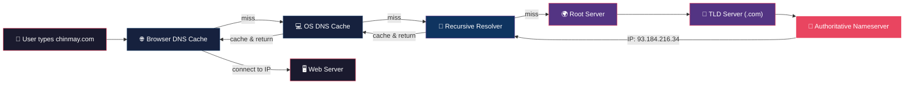

> **Key Insight:** At every level, caches are checked first. Most DNS queries are resolved from cache and never reach the root servers.

---

## Step-by-Step Flow

### Step 1: Browser DNS Cache

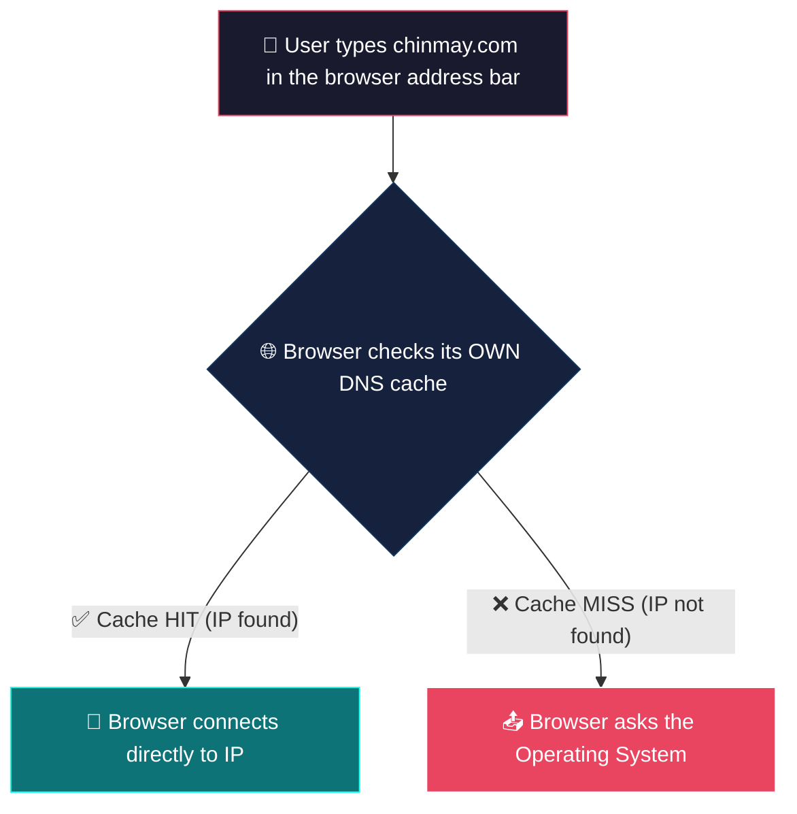

**What happens:**
- The browser maintains its **own internal DNS cache** (separate from the OS)
- Chrome: view cache at `chrome://net-internals/#dns`
- Firefox: view cache at `about:networking#dns`
- Cache entries have a **TTL (Time To Live)** — typically 60 seconds to a few minutes
- If the IP is found in cache and the TTL hasn't expired → **no network request needed**

---

### Step 2: Operating System Cache

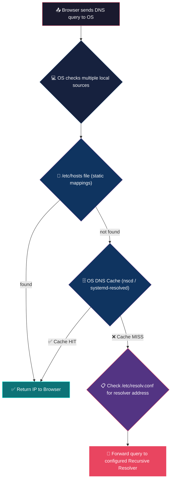

**What happens:**
- **`/etc/hosts`** — A static file mapping hostnames to IPs (checked first on most systems)
  ```
  127.0.0.1    localhost
  192.168.1.10 myserver.local
  ```
- **OS DNS Cache** — Managed by services like:
  - `systemd-resolved` (modern Linux)
  - `nscd` (Name Service Cache Daemon)
  - `dnsmasq` (lightweight caching)
  - Windows DNS Client Service
- **`/etc/resolv.conf`** — Contains the IP address of the configured DNS recursive resolver
  ```
  nameserver 8.8.8.8
  nameserver 8.8.4.4
  ```

---

### Step 3: Recursive Resolver

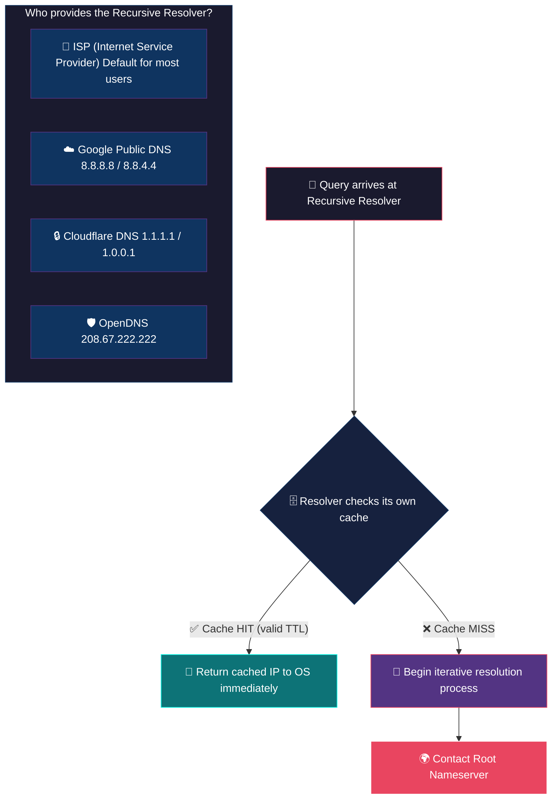

**What happens:**
- The **Recursive Resolver** (also called a **DNS Recursor**) is the workhorse of DNS
- It does the heavy lifting — walking the DNS hierarchy on your behalf
- Commonly provided by your **ISP**, but can be changed to public resolvers
- It performs **iterative queries** to root → TLD → authoritative servers
- Maintains a **large cache** (millions of entries) to speed up lookups for all its users

> **Recursive vs Iterative:**
> - **Recursive Query** = "Give me the final answer" (client → resolver)
> - **Iterative Query** = "Give me the best referral you have" (resolver → root/TLD/auth)

---

### Step 4: Root Nameservers

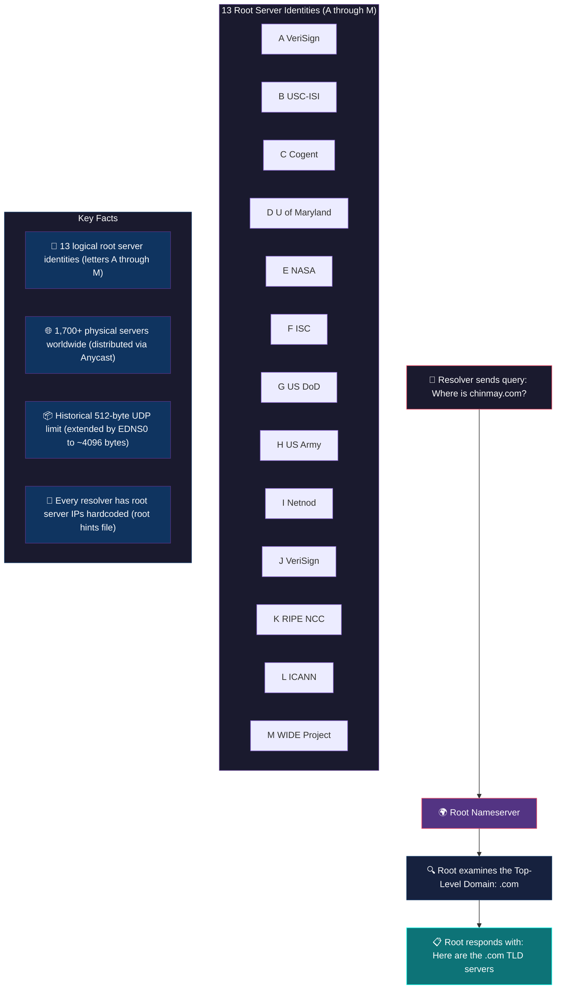

**What happens:**
- The resolver has a **hardcoded list** of root server IPs (called the "root hints" file)
- There are **13 root server identities** named `a.root-servers.net` through `m.root-servers.net`
- But behind those 13 identities are **1,700+ physical servers** worldwide using **anycast routing**
  - Anycast = multiple servers share the same IP; your query goes to the **nearest** one
- The root server **does NOT know** the IP of `chinmay.com`
- It only knows the addresses of the **TLD nameservers** (`.com`, `.org`, `.net`, `.io`, etc.)
- Response: *"I don't know chinmay.com, but here are the .com TLD servers"*

> **Historical Note:** The original DNS spec (RFC 1035) limited UDP responses to **512 bytes** — this is why there are only 13 root identities (13 × ~32 bytes for IPv4 ≈ fit in 512 bytes). **EDNS0** (RFC 6891) extended this to ~4096 bytes.

---

### Step 5: TLD Nameservers

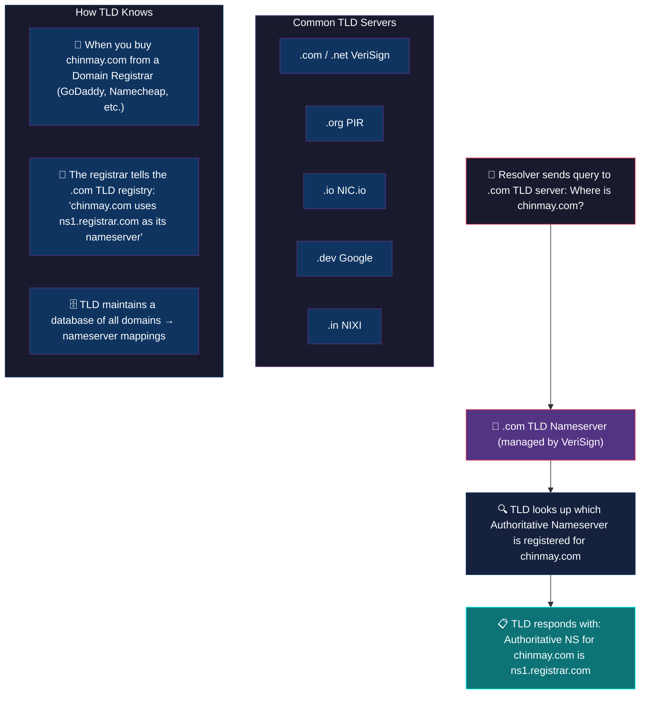

**What happens:**
- The TLD server for `.com` is managed by **VeriSign**
- It maintains a massive database of **all `.com` domains** and their authoritative nameservers
- When you register `chinmay.com` with a registrar (GoDaddy, Namecheap, Cloudflare, etc.):
  - The registrar notifies the `.com` TLD registry
  - The registry stores: `chinmay.com → ns1.yourregistrar.com`
- The TLD server **does NOT have the IP address** of `chinmay.com`
- It only knows **which authoritative nameserver** is responsible for `chinmay.com`
- Response: *"The authoritative nameserver for chinmay.com is ns1.registrar.com at IP x.x.x.x"*

---

### Step 6: Authoritative Nameserver

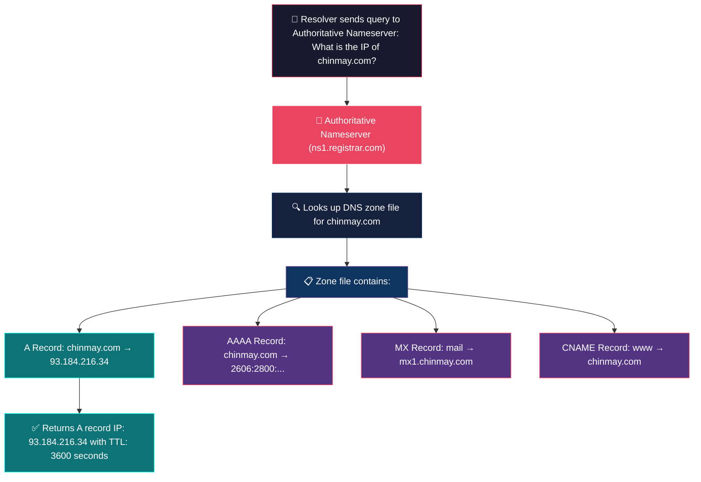

**What happens:**
- The **Authoritative Nameserver** is the **final authority** for the domain
- It contains the actual **DNS zone file** — the source of truth with all DNS records
- This is the ONLY server that has the actual **IP address mapping**
- A sample zone file for `chinmay.com`:
  ```dns
  ; Zone file for chinmay.com
  $TTL 3600

  chinmay.com.     IN    A       93.184.216.34
  chinmay.com.     IN    AAAA    2606:2800:220:1:248:1893:25c8:1946
  www.chinmay.com. IN    CNAME   chinmay.com.
  chinmay.com.     IN    MX  10  mx1.chinmay.com.
  chinmay.com.     IN    NS      ns1.registrar.com.
  chinmay.com.     IN    NS      ns2.registrar.com.
  ```
- Response: *"chinmay.com has IP 93.184.216.34, TTL 3600 seconds"*

---

### Step 7: Response Propagation


**What happens (the return journey):**

| Step | From → To | Action |
|------|-----------|--------|
| ① | Authoritative → Resolver | Resolver receives IP, **caches it** for TTL duration |
| ② | Resolver → OS | OS receives IP, **caches it** in system DNS cache |
| ③ | OS → Browser | Browser receives IP, **caches it** in browser DNS cache |
| ④ | Browser → Web Server | Browser initiates **TCP connection** to the IP address |
| ⑤ | Web Server → Browser | Server responds with the requested webpage |

---

## Complete End-to-End Flow Diagram

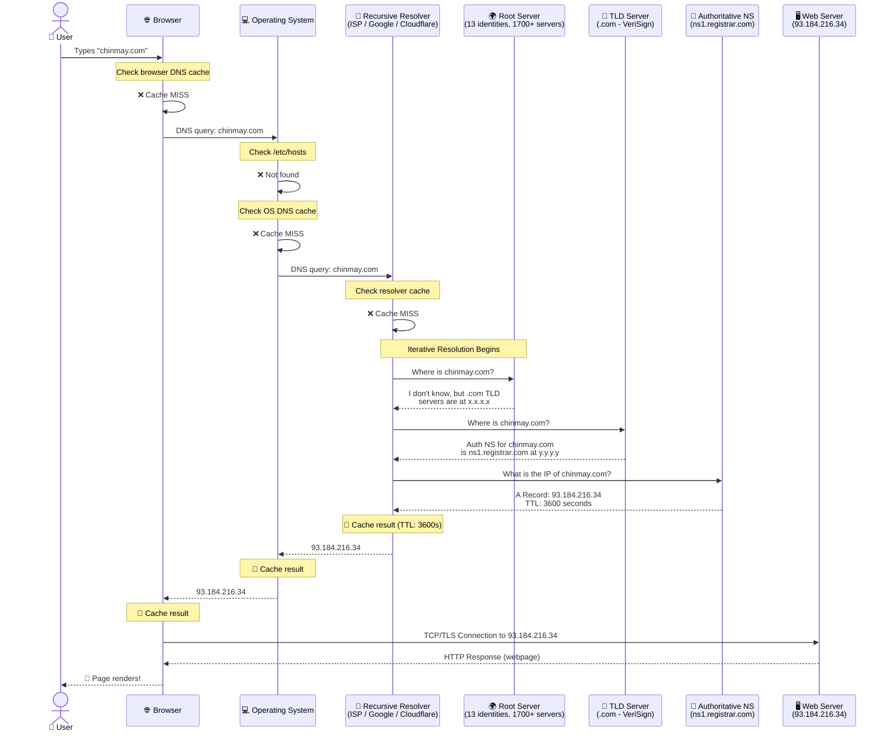

---

## DNS Caching Hierarchy

Every layer maintains its own cache to avoid redundant lookups:

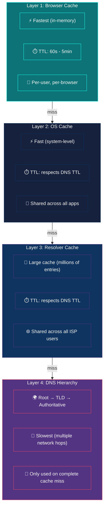

---

## Root Server Architecture

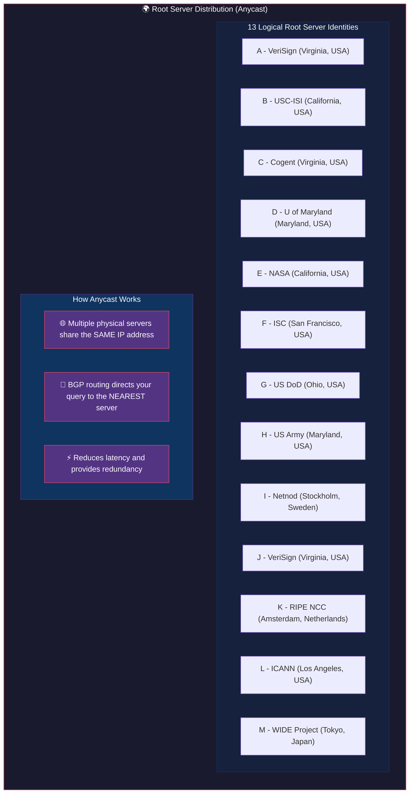

> **Why only 13?** The original DNS specification (RFC 1035) required DNS responses to fit in a **512-byte UDP packet**. Each root server entry needs ~32 bytes (name + IPv4 address). 13 entries × ~32 bytes ≈ 416 bytes, leaving room for headers. While **EDNS0** (RFC 6891) now allows larger packets (~4096 bytes), the 13 identity convention remains for backward compatibility.

---

## DNS Record Types

| Record Type | Purpose | Example |
|-------------|---------|---------|
| **A** | Maps domain to IPv4 address | `chinmay.com → 93.184.216.34` |
| **AAAA** | Maps domain to IPv6 address | `chinmay.com → 2606:2800:...` |
| **CNAME** | Alias to another domain | `www.chinmay.com → chinmay.com` |
| **MX** | Mail server for the domain | `chinmay.com → mx1.chinmay.com` |
| **NS** | Authoritative nameserver | `chinmay.com → ns1.registrar.com` |
| **TXT** | Text records (SPF, DKIM, verification) | `chinmay.com → "v=spf1 ..."` |
| **SOA** | Start of Authority (zone metadata) | Serial number, refresh intervals |
| **PTR** | Reverse DNS (IP → domain) | `93.184.216.34 → chinmay.com` |
| **SRV** | Service location | `_sip._tcp.chinmay.com → ...` |
| **CAA** | Certificate Authority Authorization | Which CAs can issue SSL certs |

---

## DNS Query Types


| Query Type | Who Uses It | Behavior |
|------------|------------|----------|
| **Recursive** | Client → Resolver | Client expects the **full answer**. The resolver handles everything. |
| **Iterative** | Resolver → DNS hierarchy | Each server gives a **referral** to the next server. The resolver follows the chain. |

---

## Performance & TTL

### Typical DNS Resolution Times

| Scenario | Latency |
|----------|---------|
| Browser cache hit | **0 ms** (instant) |
| OS cache hit | **< 1 ms** |
| Resolver cache hit | **1-10 ms** |
| Full resolution (all cache misses) | **50-200 ms** |
| Full resolution (international) | **100-500 ms** |

### What is TTL (Time To Live)?

```
TTL = How long (in seconds) a DNS record can be cached before it must be re-queried
```

| TTL Value | Duration | Use Case |
|-----------|----------|----------|
| 60 | 1 minute | Rapid DNS changes (failover) |
| 300 | 5 minutes | Frequently changing services |
| 3600 | 1 hour | Standard websites |
| 86400 | 24 hours | Stable services |
| 604800 | 7 days | Very stable records |

---

## Common Misconceptions

| Misconception | Reality |
|---------------|---------|
| ❌ "There are only 13 root servers" | ✅ 13 **identities**, but **1,700+ physical servers** via anycast |
| ❌ "DNS always uses UDP" | ✅ UDP for queries < 512 bytes (or ~4096 with EDNS0); **TCP** for zone transfers and large responses |
| ❌ "The root server knows all IPs" | ✅ Root only knows **TLD server addresses** |
| ❌ "DNS resolution is slow" | ✅ Most queries are **resolved from cache** in < 10ms |
| ❌ "The resolver checks TLD servers one by one" | ✅ It queries **one TLD server** (with automatic failover if unresponsive) |
| ❌ "DNS is a single lookup" | ✅ A full resolution involves **up to 4 separate queries** (resolver → root → TLD → auth) |

---

## Key Takeaways

1. **DNS is a hierarchical, distributed system** — no single server has all the answers
2. **Caching at every layer** dramatically reduces lookup times (most queries never leave your local cache)
3. **The recursive resolver does the heavy lifting** — it walks the DNS tree on your behalf
4. **Root servers are the starting point** — they only point to TLD servers, nothing more
5. **TLD servers point to authoritative nameservers** — they don't store IPs either
6. **Only the authoritative nameserver** has the actual domain → IP mapping
7. **Anycast routing** distributes root servers globally for low-latency access
8. **TTL controls cache duration** — balancing between performance (long TTL) and freshness (short TTL)

---

## Live DNS Trace: `dig +trace example.com`

You can **watch the entire DNS resolution happen in real time** using the `dig +trace` command. This walks through every hop — exactly matching the flow described above.

```bash
dig +trace example.com
```

### Full Output (Annotated)

---

#### 🔹 Hop 0: Local Resolver → Root Server List

```dns
; <<>> DiG 9.18.39-0ubuntu0.24.04.2-Ubuntu <<>> +trace example.com
;; global options: +cmd
.                   76310   IN  NS  m.root-servers.net.
.                   76310   IN  NS  a.root-servers.net.
.                   76310   IN  NS  b.root-servers.net.
.                   76310   IN  NS  c.root-servers.net.
.                   76310   IN  NS  d.root-servers.net.
.                   76310   IN  NS  e.root-servers.net.
.                   76310   IN  NS  f.root-servers.net.
.                   76310   IN  NS  g.root-servers.net.
.                   76310   IN  NS  h.root-servers.net.
.                   76310   IN  NS  i.root-servers.net.
.                   76310   IN  NS  j.root-servers.net.
.                   76310   IN  NS  k.root-servers.net.
.                   76310   IN  NS  l.root-servers.net.
;; Received 239 bytes from 127.0.0.53#53(127.0.0.53) in 14 ms
```

| Field | Meaning |
|-------|---------|
| `.` | The **root zone** (top of DNS hierarchy) |
| `76310` | **TTL** — this root server list is cached for ~21 hours |
| `IN NS` | Record type: **NS (Nameserver)** record for the root zone |
| `a.root-servers.net` → `m.root-servers.net` | All **13 root server identities** |
| `127.0.0.53#53` | Response came from **local systemd-resolved** stub resolver |
| `14 ms` | Time taken — fast because root hints are **cached locally** |

> **What happened:** Your local resolver already knows the 13 root server addresses (from the root hints file). It picks one to query next.

---

#### 🔹 Hop 1: Root Server → `.com` TLD Server List

```dns
com.                172800  IN  NS  a.gtld-servers.net.
com.                172800  IN  NS  b.gtld-servers.net.
com.                172800  IN  NS  c.gtld-servers.net.
com.                172800  IN  NS  d.gtld-servers.net.
com.                172800  IN  NS  e.gtld-servers.net.
com.                172800  IN  NS  f.gtld-servers.net.
com.                172800  IN  NS  g.gtld-servers.net.
com.                172800  IN  NS  h.gtld-servers.net.
com.                172800  IN  NS  i.gtld-servers.net.
com.                172800  IN  NS  j.gtld-servers.net.
com.                172800  IN  NS  k.gtld-servers.net.
com.                172800  IN  NS  l.gtld-servers.net.
com.                172800  IN  NS  m.gtld-servers.net.
com.                86400   IN  DS  19718 13 2 8ACBB0CD28F41250A80A491389424D341522D946B0DA0C0291F2D3D771D7805A
com.                86400   IN  RRSIG DS 8 1 86400 20260303050000 20260218040000 21831 . g+YEw1XKrrUX...
;; Received 1171 bytes from 192.58.128.30#53(j.root-servers.net) in 90 ms
```

| Field | Meaning |
|-------|---------|
| `com.` | The **`.com` TLD zone** |
| `172800` | **TTL = 48 hours** — TLD server list doesn't change often |
| `a.gtld-servers.net` → `m.gtld-servers.net` | **13 `.com` TLD servers** (managed by VeriSign) |
| `DS` record | **DNSSEC Delegation Signer** — used for cryptographic chain of trust |
| `RRSIG` record | **DNSSEC Signature** — proves the DS record is authentic |
| `j.root-servers.net` | Response came from **root server J** (VeriSign, Virginia) |
| `192.58.128.30#53` | The IP address of `j.root-servers.net` |
| `90 ms` | Took 90ms — this was an actual **network hop to a root server** |

> **What happened:** Root server J said *"I don't know example.com, but here are the 13 servers responsible for ALL `.com` domains."*

---

#### 🔹 Hop 2: TLD Server → Authoritative Nameserver for `example.com`

```dns
example.com.        172800  IN  NS  hera.ns.cloudflare.com.
example.com.        172800  IN  NS  elliott.ns.cloudflare.com.
example.com.        86400   IN  DS  2371 13 2 C988EC423E3880EB8DD8A46FE06CA230EE23F35B578D64E78B29C3E1C83D245A
example.com.        86400   IN  RRSIG DS 13 2 86400 20260222020434 20260215005434 35511 com. NioqcK6NyW9w...
;; Received 506 bytes from 2001:500:856e::30#53(d.gtld-servers.net) in 203 ms
```

| Field | Meaning |
|-------|---------|
| `example.com.` | The domain we're looking up |
| `172800` | **TTL = 48 hours** for the NS delegation |
| `hera.ns.cloudflare.com` | **Authoritative nameserver #1** (Cloudflare) |
| `elliott.ns.cloudflare.com` | **Authoritative nameserver #2** (Cloudflare, redundancy) |
| `DS` + `RRSIG` | **DNSSEC** records for cryptographic validation |
| `d.gtld-servers.net` | Response came from **`.com` TLD server D** |
| `2001:500:856e::30` | TLD server D's **IPv6 address** |
| `203 ms` | Took 203ms — the TLD server was further away in this case |

> **What happened:** The `.com` TLD server said *"example.com is managed by Cloudflare. Ask `hera.ns.cloudflare.com` or `elliott.ns.cloudflare.com` for the actual IP."*

---

#### 🔹 Hop 3: Authoritative Nameserver → Final IP Address ✅

```dns
example.com.        300     IN  A   104.18.27.120
example.com.        300     IN  A   104.18.26.120
example.com.        300     IN  RRSIG A 13 2 300 20260219174900 20260217154900 34505 example.com. 7J1BJw5/5mU6...
;; Received 179 bytes from 2606:4700:58::a29f:2ce4#53(elliott.ns.cloudflare.com) in 37 ms
```

| Field | Meaning |
|-------|---------|
| `example.com.` | ✅ **Final answer** for the domain |
| `300` | **TTL = 5 minutes** — Cloudflare uses short TTLs for flexibility |
| `IN A` | **A Record** — IPv4 address mapping |
| `104.18.27.120` | **First IP address** (Cloudflare's CDN) |
| `104.18.26.120` | **Second IP address** (redundancy / load balancing) |
| `RRSIG` | **DNSSEC signature** proving this A record is authentic |
| `elliott.ns.cloudflare.com` | Response came from Cloudflare's authoritative nameserver |
| `37 ms` | Took only 37ms — Cloudflare's anycast network is very fast |

> **What happened:** Cloudflare's authoritative nameserver gave the **final answer**: example.com resolves to `104.18.27.120` (and `104.18.26.120` as a backup). Two IPs are returned for **load balancing and redundancy**.

---

### Summary: The 4 Hops Visualized

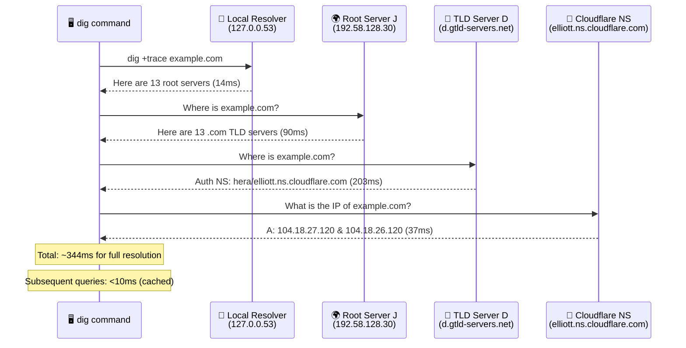

### Key Observations from the Trace

| Metric | Value | Significance |
|--------|-------|-------------|
| **Total hops** | 4 | Local → Root → TLD → Authoritative |
| **Total time** | ~344 ms | Sum of all round trips (14+90+203+37) |
| **Slowest hop** | TLD → Auth (203 ms) | Geographic distance to `d.gtld-servers.net` |
| **Fastest hop** | Local resolver (14 ms) | Root hints are cached locally |
| **Protocol** | UDP over IPv6 | TLD and Auth servers responded via IPv6 |
| **DNSSEC** | ✅ Enabled | DS + RRSIG records at every delegation |
| **Load balancing** | 2 A records | Two IPs returned for redundancy |
| **Auth TTL** | 300s (5 min) | Cloudflare prefers short TTLs for agility |

### Try It Yourself

```bash
# Full trace (what we did above)
dig +trace example.com

# Quick lookup (uses resolver cache)
dig example.com

# Query a specific DNS server
dig @8.8.8.8 example.com

# See all record types
dig example.com ANY

# Reverse DNS lookup
dig -x 104.18.27.120

# Check specific record type
dig example.com MX
dig example.com NS
dig example.com TXT
```

---

> **Next:** Learn about [CDN (Content Delivery Networks)](./networking.md) and how they use DNS for global load balancing.
