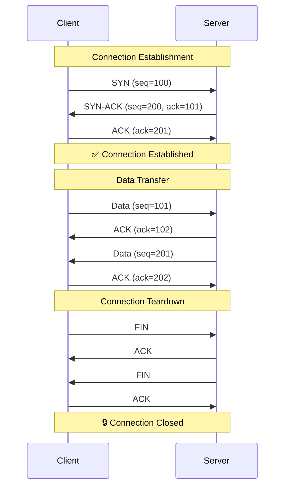
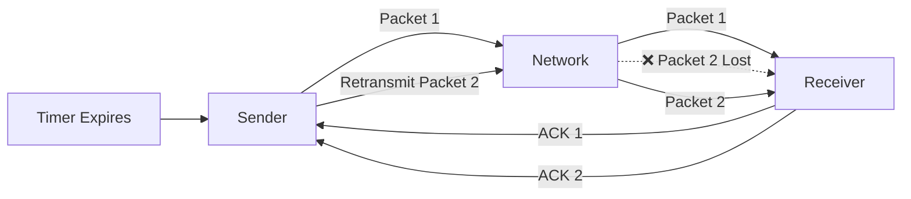
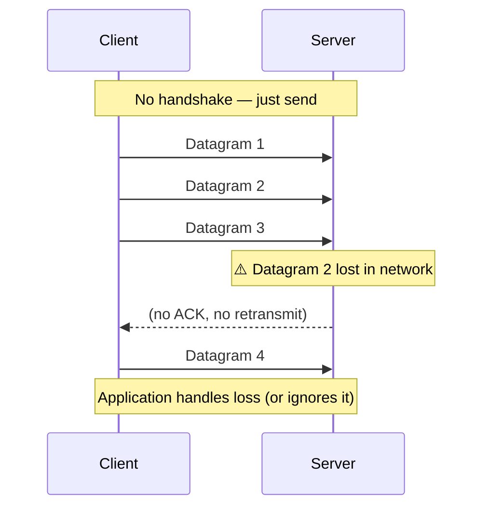
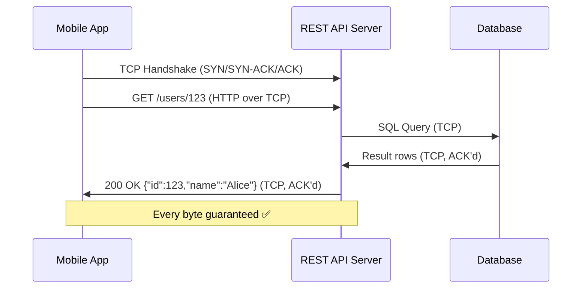
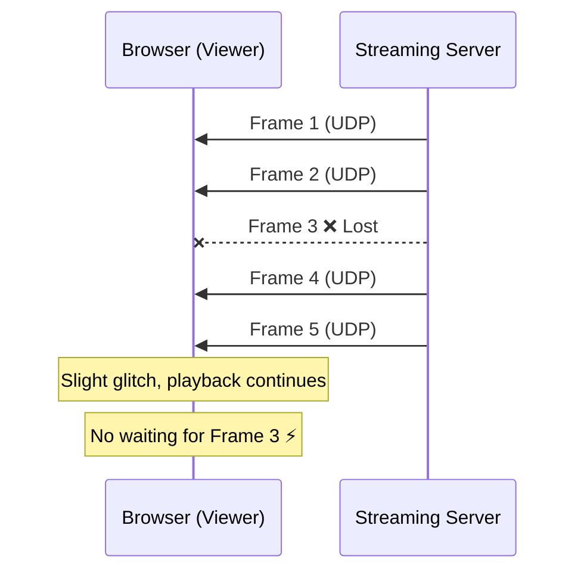
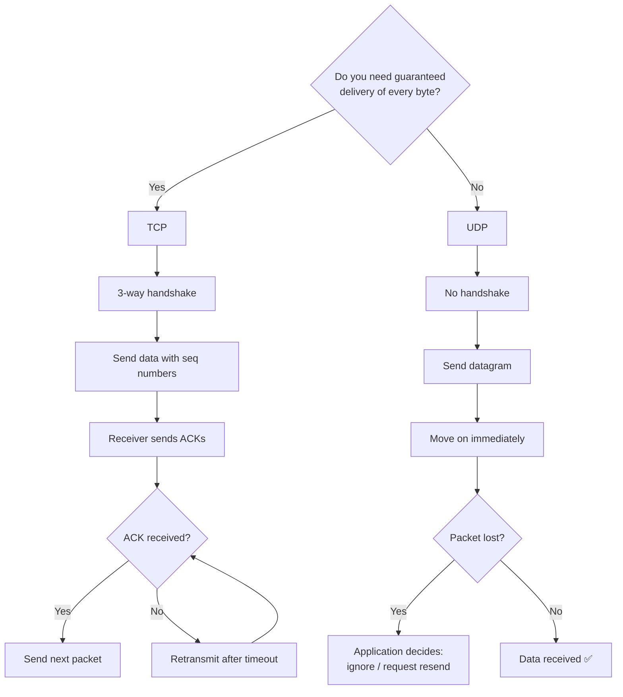

# TCP vs UDP — Reliable vs Fast Delivery

> **Core question**: Do you need *guaranteed delivery* or *low latency*?  
> The answer determines which protocol to use.

---

## The Big Picture

| | TCP | UDP |
|---|---|---|
| **Connection** | Connection-oriented (handshake first) | Connectionless (fire and forget) |
| **Reliability** | Guaranteed delivery via ACKs | Best-effort, no guarantees |
| **Ordering** | Packets arrive in order | Packets may arrive out of order |
| **Speed** | Slower (overhead from handshake + ACKs) | Faster (minimal overhead) |
| **Error Checking** | Checksum + retransmission | Checksum only (no retransmission) |
| **Header Size** | 20–60 bytes | 8 bytes |
| **State** | Stateful | Stateless |
| **Use When** | Data integrity matters | Speed matters, some loss is OK |

---

## TCP — Transmission Control Protocol

TCP guarantees that every byte you send **arrives, in order, exactly once**.  
It achieves this through a **3-way handshake** and **acknowledgements (ACKs)**.

### TCP 3-Way Handshake



### How TCP Ensures Reliability



### TCP Features
- **Sequence numbers** — reassemble out-of-order packets
- **ACKs** — confirm receipt; sender retransmits on timeout
- **Flow Control** — receiver advertises window size; sender throttles
- **Congestion Control** — slow start, fast retransmit, fast recovery
- **Full-duplex** — data flows both directions simultaneously

---

## UDP — User Datagram Protocol

UDP puts **speed above reliability**. No handshake. No ACKs. No retransmission.  
Send the packet and move on — whether it arrives or not is not UDP's problem.

### UDP — Fire and Forget



### UDP Packet Structure (8-byte header)

```
 0      7 8     15 16    23 24    31
+--------+--------+--------+--------+
| Source Port  | Destination Port   |
+--------+--------+--------+--------+
|    Length    |     Checksum       |
+--------+--------+--------+--------+
|          Data (payload)           |
+-----------------------------------+
```

Compare this to TCP's 20–60 byte header — UDP's simplicity = less overhead = lower latency.

---

## Real-World Examples

### TCP in Action — REST API Call

Every HTTP/HTTPS request (like a REST API call) runs over TCP.  
You cannot afford to lose data — a missing JSON field would corrupt the response.



**Other TCP use cases:** Web browsing, email (SMTP/IMAP), file transfer (FTP/SFTP), database connections (PostgreSQL, MySQL), WebSockets (also TCP — persistent TCP connection, not UDP).

---

### UDP in Action — Live Video Streaming

A video stream (WebRTC, live sport broadcast) uses UDP.  
If a frame is lost, it's better to show a glitch and move on than to freeze and retransmit.



**Other UDP use cases:**
| Use Case | Why UDP |
|---|---|
| DNS lookups | Single request/response, fast, retried by app |
| VoIP (Zoom, phone calls) | Latency > reliability; slight static is fine |
| Online gaming | Position updates — old data is useless anyway |
| IoT sensors | Continuous telemetry; occasional loss is acceptable |
| Video streaming (WebRTC) | Real-time; buffering kills UX |

---

## Comparison: TCP vs UDP Flow



---

## Common Misconceptions

| Misconception | Reality |
|---|---|
| **WebSockets use UDP** | ❌ WebSockets run over **TCP**. They're a persistent TCP connection with a lightweight framing protocol on top. |
| **UDP has no error checking** | ❌ UDP **does** have a checksum. It just doesn't retransmit if errors are found. |
| **TCP is always slower** | ⚠️ On LAN or low-packet-loss networks, the difference is negligible. TCP is slower mainly when packet loss is high (retransmissions add latency). |
| **UDP is unreliable for any use** | ❌ Many protocols (QUIC, WebRTC, DTLS) build their own reliability on top of UDP to get the best of both worlds. |

---

## Decision Cheat Sheet

```
Need to transfer a file?          → TCP  (every byte matters)
Building a REST API?               → TCP  (HTTP runs on TCP)
Real-time voice/video call?        → UDP  (latency > perfection)
DNS query?                         → UDP  (small, fast, retryable)
Online multiplayer game?           → UDP  (stale data is useless)
WebSocket chat app?                → TCP  (WebSockets = persistent TCP)
IoT sensor data stream?            → UDP  (some loss is fine)
Database connection?               → TCP  (data integrity critical)
```

---

## Key Takeaways

1. **TCP** = reliable, ordered, slower. Use for anything where **data integrity** matters (web, databases, APIs, file transfer).
2. **UDP** = fast, stateless, no guarantees. Use for **real-time** applications where **latency** matters more than perfect delivery (video, gaming, DNS, VoIP).
3. **WebSockets** are **TCP** — a persistent HTTP-upgraded TCP connection, not UDP.
4. Modern protocols like **QUIC** (used by HTTP/3) run over UDP but implement their own reliability — getting TCP-like guarantees with UDP-like speed.