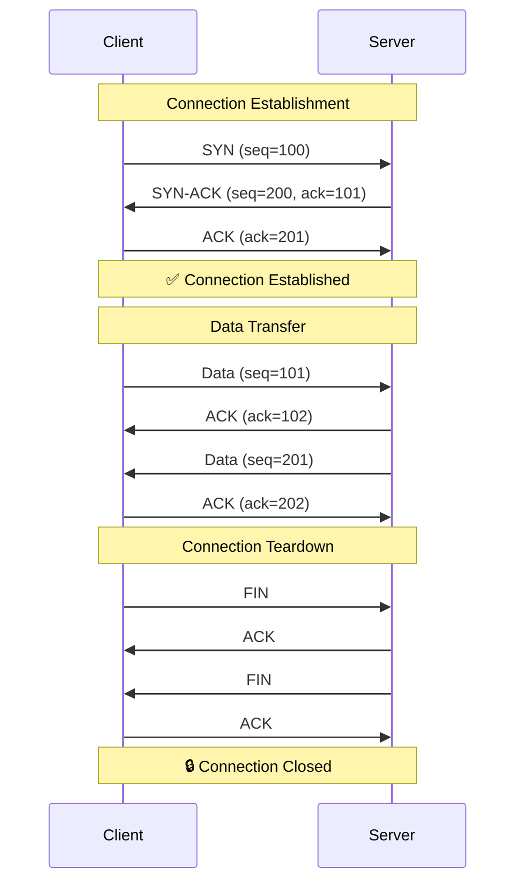
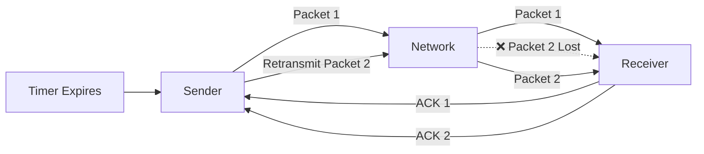
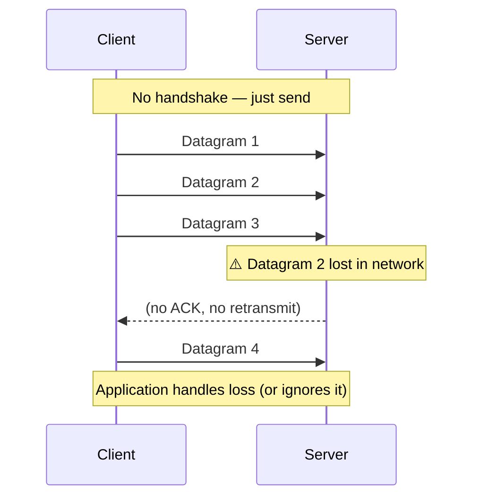
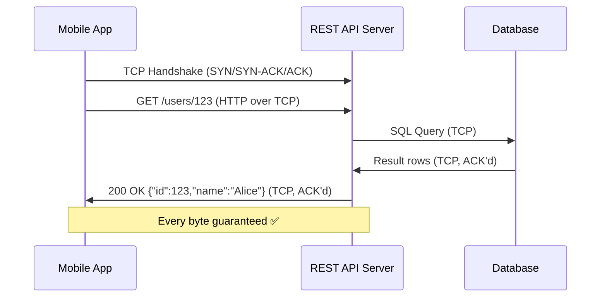
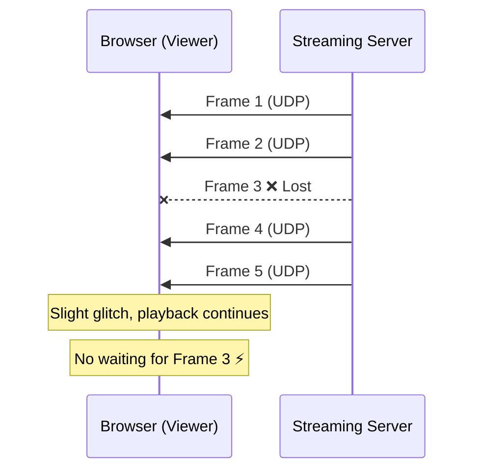
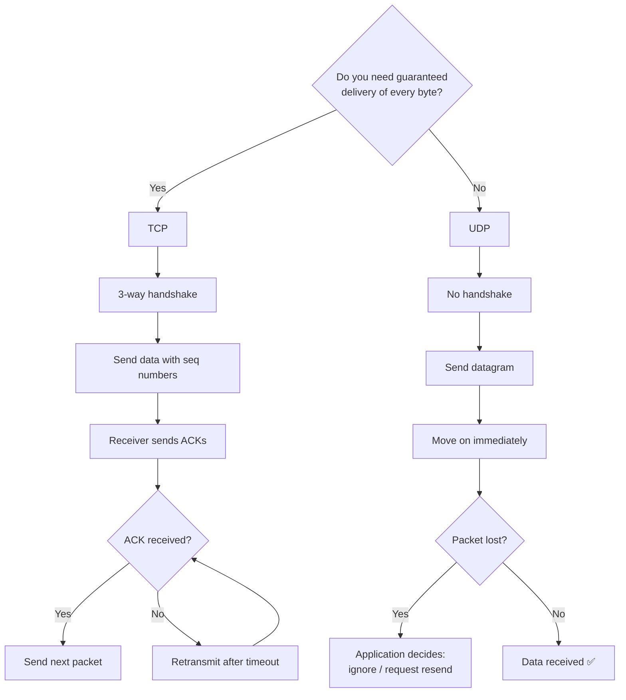
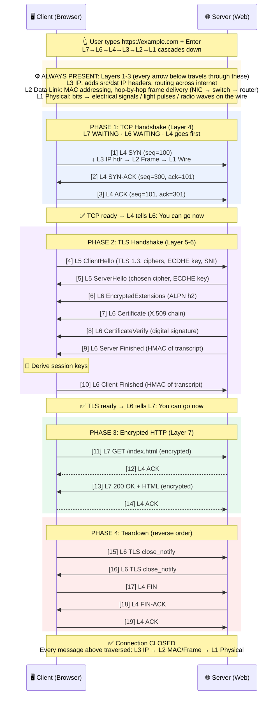

# TCP vs UDP — Reliable vs Fast Delivery

> **Core question**: Do you need *guaranteed delivery* or *low latency*?  
> The answer determines which protocol to use.

---

## The Big Picture

| | TCP | UDP |
|---|---|---|
| **Connection** | Connection-oriented (handshake first) | Connectionless (fire and forget) |
| **Reliability** | Guaranteed delivery via ACKs | Best-effort, no guarantees |
| **Ordering** | Packets arrive in order | Packets may arrive out of order |
| **Speed** | Slower (overhead from handshake + ACKs) | Faster (minimal overhead) |
| **Error Checking** | Checksum + retransmission | Checksum only (no retransmission) |
| **Header Size** | 20–60 bytes | 8 bytes |
| **State** | Stateful | Stateless |
| **Use When** | Data integrity matters | Speed matters, some loss is OK |

---

## TCP — Transmission Control Protocol

TCP guarantees that every byte you send **arrives, in order, exactly once**.  
It achieves this through a **3-way handshake** and **acknowledgements (ACKs)**.

### TCP 3-Way Handshake



### How TCP Ensures Reliability



### TCP Features
- **Sequence numbers** — reassemble out-of-order packets
- **ACKs** — confirm receipt; sender retransmits on timeout
- **Flow Control** — receiver advertises window size; sender throttles
- **Congestion Control** — slow start, fast retransmit, fast recovery
- **Full-duplex** — data flows both directions simultaneously

---

## UDP — User Datagram Protocol

UDP puts **speed above reliability**. No handshake. No ACKs. No retransmission.  
Send the packet and move on — whether it arrives or not is not UDP's problem.

### UDP — Fire and Forget



### UDP Packet Structure (8-byte header)

```
 0      7 8     15 16    23 24    31
+--------+--------+--------+--------+
| Source Port  | Destination Port   |
+--------+--------+--------+--------+
|    Length    |     Checksum       |
+--------+--------+--------+--------+
|          Data (payload)           |
+-----------------------------------+
```

**Field-by-field breakdown:**

| Field | Size | Purpose |
|---|---|---|
| **Source Port** | 16 bits (2 bytes) | Port of the sender. Optional — can be `0` if no reply is expected (e.g., fire-and-forget telemetry). |
| **Destination Port** | 16 bits (2 bytes) | Port of the receiver. This is how the OS knows which application should get the datagram (e.g., port `53` → DNS). |
| **Length** | 16 bits (2 bytes) | Total size of the UDP datagram (header + payload) in bytes. Minimum value is `8` (header only, no payload). Max is `65,535` bytes. |
| **Checksum** | 16 bits (2 bytes) | Error detection for the header + data. If the checksum fails, the datagram is **silently discarded** — no retransmission, no notification to the sender. Optional in IPv4, mandatory in IPv6. |

> **Why only 8 bytes?**  
> UDP has no sequence numbers, no ACK fields, no window size, no flags — all things TCP needs for reliability.  
> That's the trade-off: TCP's 20–60 byte header buys you guaranteed delivery; UDP's tiny 8-byte header buys you **speed**.

Compare this to TCP's 20–60 byte header — UDP's simplicity = less overhead = lower latency.

---

## Real-World Examples

### TCP in Action — REST API Call

Every HTTP/HTTPS request (like a REST API call) runs over TCP.  
You cannot afford to lose data — a missing JSON field would corrupt the response.



**Other TCP use cases:** Web browsing, email (SMTP/IMAP), file transfer (FTP/SFTP), database connections (PostgreSQL, MySQL), WebSockets (also TCP — persistent TCP connection, not UDP).

---

### UDP in Action — Live Video Streaming

A video stream (WebRTC, live sport broadcast) uses UDP.  
If a frame is lost, it's better to show a glitch and move on than to freeze and retransmit.



**Other UDP use cases:**
| Use Case | Why UDP |
|---|---|
| DNS lookups | Single request/response, fast, retried by app |
| VoIP (Zoom, phone calls) | Latency > reliability; slight static is fine |
| Online gaming | Position updates — old data is useless anyway |
| IoT sensors | Continuous telemetry; occasional loss is acceptable |
| Video streaming (WebRTC) | Real-time; buffering kills UX |

---

## Comparison: TCP vs UDP Flow



---

## Common Misconceptions

| Misconception | Reality |
|---|---|
| **WebSockets use UDP** | ❌ WebSockets run over **TCP**. They're a persistent TCP connection with a lightweight framing protocol on top. |
| **UDP has no error checking** | ❌ UDP **does** have a checksum. It just doesn't retransmit if errors are found. |
| **TCP is always slower** | ⚠️ On LAN or low-packet-loss networks, the difference is negligible. TCP is slower mainly when packet loss is high (retransmissions add latency). |
| **UDP is unreliable for any use** | ❌ Many protocols (QUIC, WebRTC, DTLS) build their own reliability on top of UDP to get the best of both worlds. |

---

## Decision Cheat Sheet

```
Need to transfer a file?          → TCP  (every byte matters)
Building a REST API?               → TCP  (HTTP runs on TCP)
Real-time voice/video call?        → UDP  (latency > perfection)
DNS query?                         → UDP  (small, fast, retryable)
Online multiplayer game?           → UDP  (stale data is useless)
WebSocket chat app?                → TCP  (WebSockets = persistent TCP)
IoT sensor data stream?            → UDP  (some loss is fine)
Database connection?               → TCP  (data integrity critical)
```

---

## Key Takeaways

1. **TCP** = reliable, ordered, slower. Use for anything where **data integrity** matters (web, databases, APIs, file transfer).
2. **UDP** = fast, stateless, no guarantees. Use for **real-time** applications where **latency** matters more than perfect delivery (video, gaming, DNS, VoIP).
3. **WebSockets** are **TCP** — a persistent HTTP-upgraded TCP connection, not UDP.
4. Modern protocols like **QUIC** (used by HTTP/3) run over UDP but implement their own reliability — getting TCP-like guarantees with UDP-like speed.


## Diagram 



### TLS 1.3 Handshake — What Each Term Means

The TLS handshake is how the client and server **agree on encryption** before any HTTP data flows. Here's every term from the diagram explained:

---

#### `[4] ClientHello` — *"Here's what I support, let's talk securely"*

| Field | What It Is | Analogy |
|---|---|---|
| **TLS 1.3** | The version of TLS the client wants to use. 1.3 is the latest — faster and more secure than 1.2. | *"I speak TLS version 1.3"* |
| **Ciphers** | A list of encryption algorithms the client supports (e.g., `AES-256-GCM`, `CHACHA20`). The server picks one. | *"I can lock things with any of these locks — pick one you also have"* |
| **ECDHE key** | The client's half of the **key exchange**. ECDHE = Elliptic Curve Diffie-Hellman Ephemeral. Both sides generate a temporary key pair; they combine halves to create a **shared secret** without ever sending it over the wire. **Ephemeral** = new key pair per session → even if one session leaks, old sessions stay safe (forward secrecy). | *"Here's my half of the secret — combine it with your half to get our shared key"* |
| **SNI** | **Server Name Indication** — the hostname the client wants (e.g., `example.com`). Needed because one IP can host many domains. Sent in plaintext (this is why it's visible to network observers). | *"I'm looking for apartment 4B"* (the building has many apartments behind one door) |

---

#### `[5] ServerHello` — *"Got it, here's what I chose"*

| Field | What It Is |
|---|---|
| **Chosen cipher** | The single encryption algorithm the server picked from the client's list (e.g., `TLS_AES_256_GCM_SHA384`). |
| **ECDHE key** | The server's half of the key exchange. Now **both sides** can independently compute the same shared secret. |

> 🔑 At this point, both client and server can derive the **session keys** — all further messages are encrypted.

---

#### `[6] EncryptedExtensions` — *"Some extra config, now encrypted"*

| Field | What It Is |
|---|---|
| **ALPN h2** | **Application-Layer Protocol Negotiation** — tells the client which app protocol to use. `h2` = HTTP/2. Could also be `http/1.1` or `h3` (HTTP/3). This avoids an extra round-trip to negotiate the HTTP version later. |

---

#### `[7] Certificate` — *"Here's proof I'm really example.com"*

| Field | What It Is |
|---|---|
| **X.509 chain** | The server's digital certificate + intermediate CA certificates forming a **chain of trust** back to a root CA that your browser already trusts. Contains: the domain name, public key, issuer (e.g., Let's Encrypt), expiry date, and a digital signature from the CA. |

> Your browser checks: Is this cert for `example.com`? Is it expired? Is the CA trusted? Is the chain intact?

---

#### `[8] CertificateVerify` — *"And I can prove I own that certificate"*

| Field | What It Is |
|---|---|
| **Digital signature** | The server signs a hash of the entire handshake transcript so far using its **private key**. The client verifies this signature with the public key from the certificate. This proves the server actually **possesses** the private key (not just a stolen cert). |

---

#### `[9] Server Finished` / `[10] Client Finished` — *"We both agree on everything"*

| Field | What It Is |
|---|---|
| **HMAC of transcript** | A cryptographic hash (HMAC) of the entire handshake conversation. Both sides compute this independently. If they match, it proves: (1) no one tampered with the handshake, (2) both sides derived the same keys, (3) the handshake is complete. |

---

#### Summary: What TLS 1.3 Achieves in 1 Round-Trip

```
Client                                    Server
  |                                         |
  |--- ClientHello ----------------------→  |  (ciphers, ECDHE key, SNI)
  |                                         |
  |  ←--- ServerHello -------------------  |  (chosen cipher, ECDHE key)
  |  ←--- EncryptedExtensions -----------  |  (ALPN)
  |  ←--- Certificate -------------------  |  (X.509 chain)
  |  ←--- CertificateVerify -------------  |  (signature proof)
  |  ←--- Server Finished ---------------  |  (HMAC)
  |                                         |
  |--- Client Finished -----------------→  |  (HMAC)
  |                                         |
  |========= ENCRYPTED DATA FLOWS =========|
```

> **TLS 1.2 needed 2 round-trips.** TLS 1.3 does it in **1 round-trip** because the client sends its ECDHE key in the very first message (no waiting to agree on parameters first).